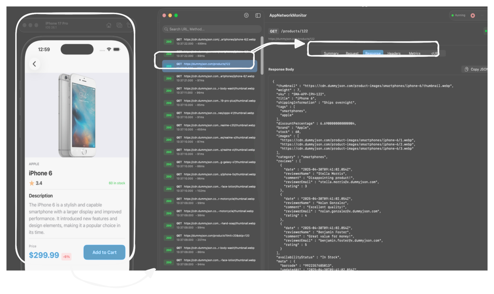

# AppNetworkMonitor

[](https://developer.apple.com/swift/)
[](LICENSE)



**AppNetworkMonitor** is a powerful, invasive network monitoring agent for iOS applications.

Built on top of the amazing [Pulse](https://github.com/kean/Pulse) framework, this library goes a step further by injecting an **auto-instrumentation layer** into your app. It automatically intercepts, records, and streams network traffic (including WebSocket and standard HTTP/HTTPS), regardless of how your networking stack is configured.

> **IMPORTANT: FOR DEBUG USE ONLY**
>
> This library uses method swizzling and network interception techniques intended solely for development and debugging purposes. **Do not include this library in Release/App Store builds.**

## Features

- **Zero-Config Interception:** Automatically hooks into `URLSession` to capture traffic without requiring code changes in your networking layer.
- **SSL Pinning Bypass:** Capable of inspecting traffic even in environments with strict SSL Pinning (by acting as an internal transparent proxy/interceptor).
- **Pulse Integration:** Uses the robust Pulse engine for storage and on-device UI visualization.
- **Remote Streaming:** Streams logs and network traffic in real-time to the **AppNetworkMonitor macOS Client** (via Bonjour/TCP).
- **Shake**: Shake your device to open PulseUI showing all of requests.
- **Invasive Debugging:** Captures headers, bodies, metrics, and errors that standard loggers might miss.

## Installation

### Swift Package Manager

Add `AppNetworkMonitor` to your project via Xcode:

1. Go to **File > Add Package Dependencies...**
2. Enter the repository URL: `https://github.com/christianalexandre/app-network-monitor`
3. Select **Up to Next Major Version** (e.g., `1.0.1`).

## Getting Started

Since this library is invasive, **you must ensure it only runs in Debug builds**.

### 1. Import Conditionally

In your `App.swift` or `AppDelegate.swift`, wrap the import statement to prevent linking in Release builds:

```swift
import SwiftUI

#if DEBUG
import AppNetworkMonitor
#endif
```

### 2. Initialize the Agent

Call the start() method as early as possible in your app's lifecycle.

```swift
@main
struct YourApp: App {
    init() {
        setupMonitoring()
    }

    private func setupMonitoring() {
        #if DEBUG
        // Starts the interception engine and attempts to connect 
        // to the macOS Client via Bonjour.
        PulseBridge.shared.start() 
        #endif
    }

    var body: some Scene {
        WindowGroup {
            ContentView()
        }
    }
}
```

That's it! The agent will now automatically:

1. Detect URLSession configurations.
2. Inject the monitoring protocols.
3. Start logging to Pulse and broadcasting to the Mac App.

## Companion App

This library is designed to work with the [AppNetworkMonitor macOS Client](https://github.com/christianalexandre/app-network-monitor-client).
- Ensure both devices are on the same Wi-Fi network.
- The library uses Bonjour (_appmonitor._tcp) to auto-discover the desktop client.

## Example Integration

Want to see it in action? 

Check out the **[FakeStore SwiftUI](https://github.com/christianalexandre/fakestore-swiftui)** sample project. 

You can view **[this specific commit](https://github.com/christianalexandre/fakestore-swiftui/commit/9265fe07e8ae3239ff5b06baa7cf06b85b8d1054)** to see exactly which files need to be modified to integrate `AppNetworkMonitor` into an existing app.

## License
This project is licensed under the MIT License - see the LICENSE file for details.

## Acknowledgments
This library wraps and extends [Pulse](https://github.com/kean/Pulse) by [Alex Grebenyuk](https://github.com/kean).